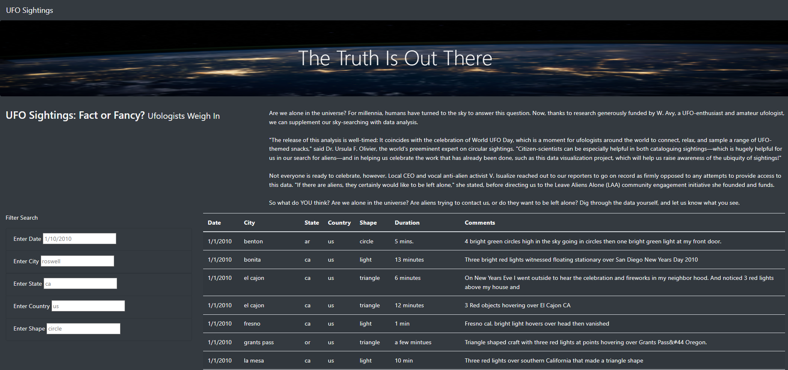
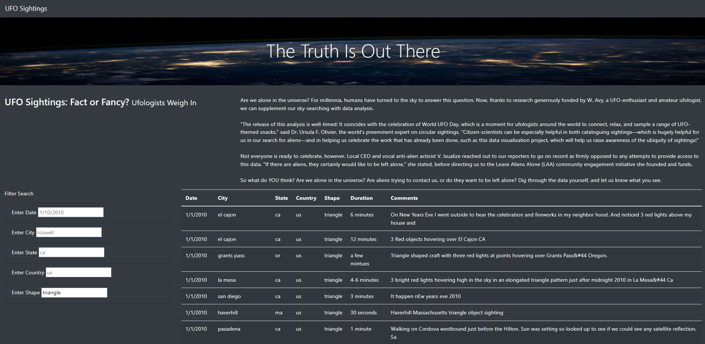
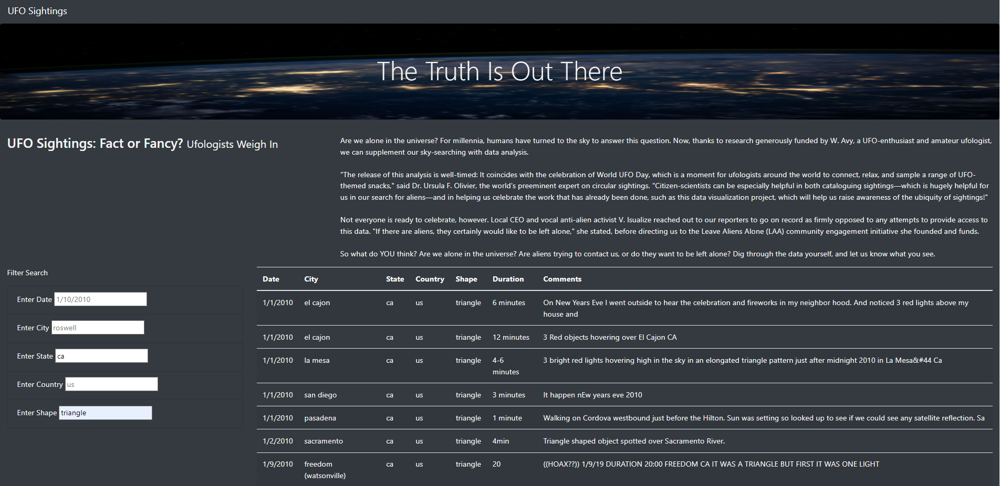

# UFOs_Challenge
The truth is out there. The following is code to generate a website with filterable search results of close encounters with the third kind (UFOs).

# Overview of Project: 
In this repository, you'll find a dynamic website built from a myriad of lines of UFO data. Since the all this data can be so overwhelming for a typical user, the purpose of this analysis was to build a filterable table using data stored in a JavaScript array. The website was created with multiple filters to make this table fully dynamic, meaning that it will react to user input, and then place the table into an HTML file for easy viewing.

# Results: 

The website was customized using Bootstrap, and the table was equipped with several fully functional filters that will allow users to interact with our visualizations. Study the below image and we'll begin to learn more about the specific filters for this data project.

The storyboard of the website is important to have the components neatly organized.The storyboard, or layout, served as the blueprint for this site and helps with the transition from idea to finished product. It helps make sure it captures everything that needs to be displayed and aid the user in navigation. The basic map of the website consists of the following:

The top component consists of a Jumbotron for the header which takes up the whole row. In the next row, this is followed by a written snippet explaining the purpose of this website. This row is divided by 3 columns and 9 columns for the title and paragraph. After that a grid system for the filters and table is provided in the next row. See the following image:

When the user enters the website they can input either the date, city, state, country, or shape. Within the Javascript code, there is a line of code that acts as a listener for any changes to the filter's input. The Javascript will place any inputs into an array, extract the filter id, and then attempt to match the filters with the predetermined keys and their associated values. When one filter is added to the input box, the user can expect an image as shown below:

The user can filter this even further by adding another input to refine their search. An example of this would look like the image below:

With some simple tests, the user should be able to quickly decipher the information they need in a timely manner.

# Summary: 

In summary, the truth is out that Javascript is a very powerful language that can, in conjunction with other built libraries, create beautiful dynamic webpages that handle large amounts of data.

A drawback of this website is that the user needs to know exactly what inputs to put in. For example, placing "lemon grove" as an input will return the exact match of this. Placing a string such as "lemon" or "lemon Grove" will not yield the same results. The code should be modified to yield similar and not strict equality. Another drawback of the code is that when one of the filters is wrong, it won't reset and re-filter when the filter input is corrected. Instead the user has to reset all the inputs, and not just correct it there and then.

Further development of the code should include the afforementioned flexibility in the search. The code can be improved by having the searches yield results that are partial, especially for two word inputs. The code can also be expanded upon by making it so that the search is instantly filtering as the user types. While the code does filter when the user clicks out and hits enter in the filter, it would be much more appealing to see it filtering in real time. Moreoever, the point of this data is to be able to filter the data that is useful to the user, but the user has no way to extract this data. A useful feature to deploy would be an extract/export function that allows the user to take the data they want into an excel or PDF page.